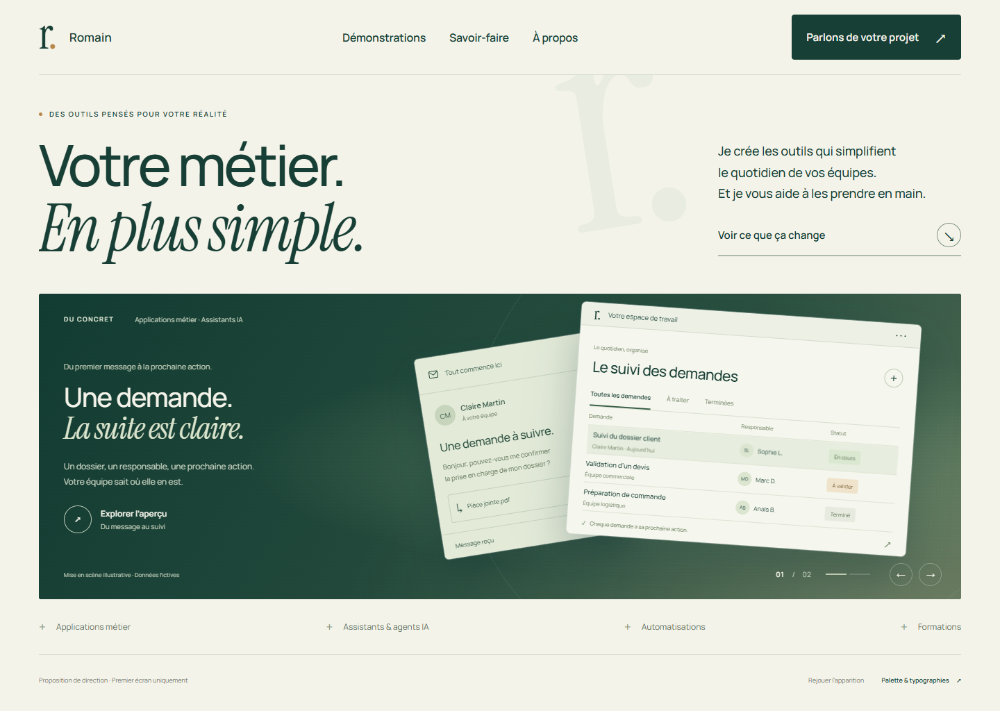
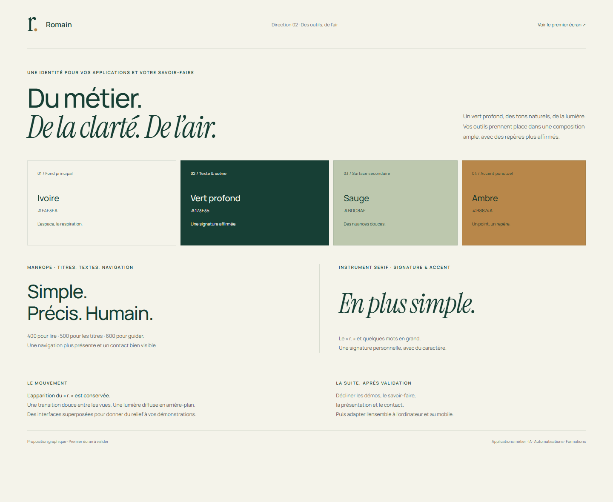

# Direction de la vitrine

Maquette locale du premier écran uniquement, à valider avant de décliner les autres sections et les formats ordinateur et mobile. Elle n’est reliée ni à la racine de l’application ni au déploiement.

- `index.html` : premier écran, apparition du monogramme, deux vues illustratives d’une application métier dans le slider.
- `direction.html` : palette et typographies proposées.

La deuxième proposition conserve la palette, l’apparition du logo et l’espace de la première. À la demande de Romain, la composition présente désormais une application métier et un assistant : réception d’un message, suivi d’un dossier, réponse à valider. Ce sont des illustrations avec des données fictives, en attendant ses démonstrations. Aucune fonctionnalité d’IA ou d’envoi n’est simulée comme étant réelle.

Navigation plus grande et plus marquée, bouton de contact vert, introduction plus lisible et appel à découvrir les démos renforcé.

Référence de mise en scène : https://www.creativeans.com/ (apparition, ampleur des projets, profondeur du fond). La composition, la palette et les typographies de cette proposition sont propres à Romain.

Palette : ivoire `#F4F3EA`, vert profond `#173F35`, sauge `#BDC8AE`, ambre `#B8874A`. L’ambre sert de petit accent ; les textes courants restent en vert profond sur ivoire. Manrope pour les titres et textes ; Instrument Serif pour le monogramme et quelques accents.

La navigation secondaire montre uniquement l’emplacement des futures sections. Le contact n’envoie rien. Le slider est manuel ; « Explorer l’aperçu » ouvre la composition agrandie. Les mouvements sont désactivés avec `prefers-reduced-motion`. Les polices sont embarquées et leurs licences sont conservées dans `assets/`.

Ouvrir `index.html` directement, ou servir ce dossier avec un serveur statique local. Aucune dépendance de l’application n’a été ajoutée.

## Aperçus

